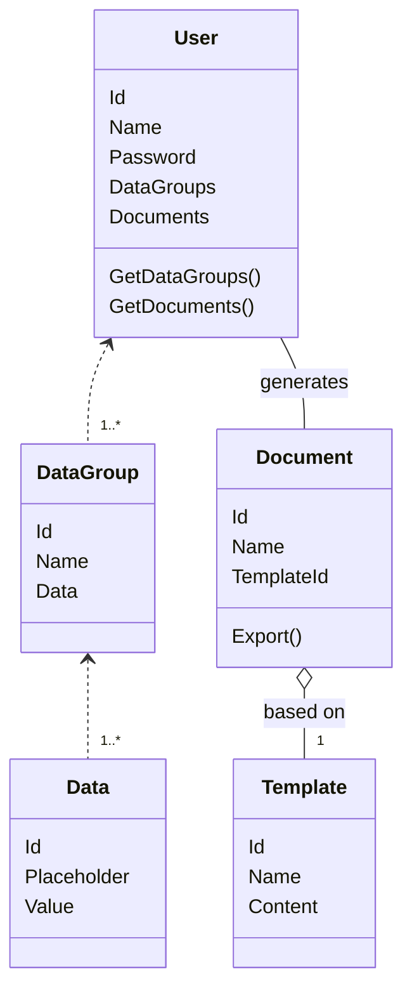

# Electroform Lite



## Template example

```
CERERE ALOCARE CREDENTIALE PENTRU PLATA IMPOZITELOR ȘI TAXELOR LOCALE
PENTRU PERSOANE FIZICE,
PRIN WWW.GHISEUL.RO

Subsemnatul/a [Nume] [Prenume], CNP [CNP], cu domiciliul în județul [Judet]
localitatea [Localitate], strada [Strada], nr [Numarul], bloc [Bloc], scara
[Scara], etaj [Etaj], apartament [Apartament], e-mail [Email], numar de
telefon [Telefon], solicit a-mi fi atribuit credențial în
vederea plății prin www.ghiseul.ro
	- Sunt de acord ca orice corespondență să fie expediată doar pe adresa
de e-mail mai sus menționată sau telefonic;
	- Ridicarea credențialului se va face personal sau prin mandatar, dacă
nu este comunicat la adresa de e-mail mai sus menționată;
	- Plata se va efectua doar prin intermediul unui card bancar;
	- Atașez la prezenta cerere, copie a actului de identitate a numitului/ei
[Nume] [Prenume]

Data [DateTime.Today]							Semnătura
```

All the values between square brackets represent data placeholders. In order to generate the document, we replace the placeholders from the template with their respective values that are obtained from the user data.
