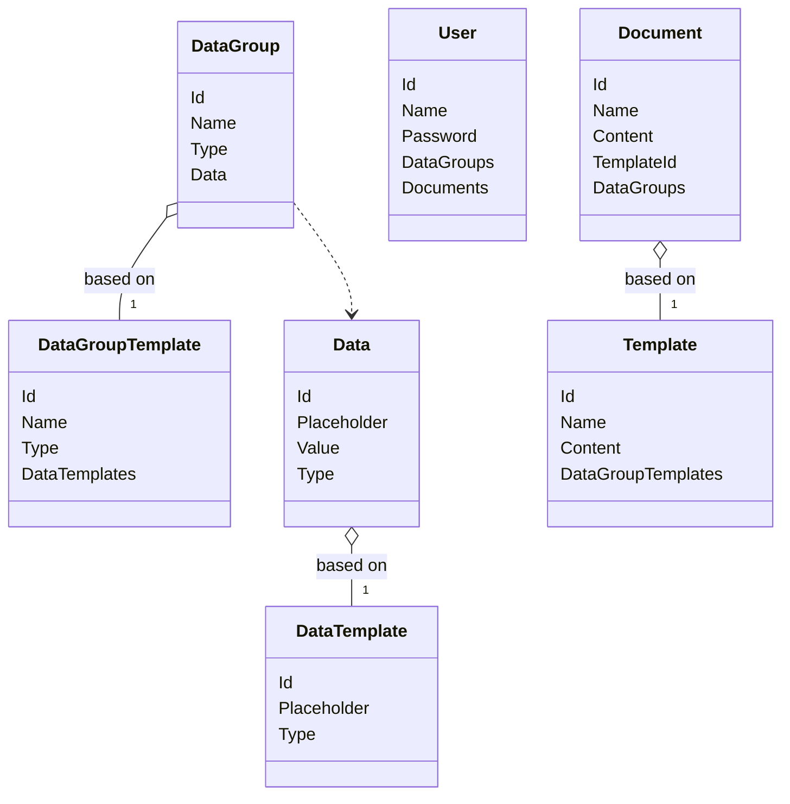

# Electroform Lite



## Template example

```
Cerere Alocare Credentiale Pentru Plata Impozitelor Si Taxelor Locale Pentru Persoane Fizice

Subsemnatul/a [Person.FirstName] [Person.LastName], e-mail [Contact.Email], numar de
telefon [Contact.PhoneNumber], solicit a-mi fi atribuit credential in
vederea platii prin www.ghiseul.ro
	- Sunt de acord ca orice corespondenta sa fie expediata doar pe adresa
de e-mail mai sus mentionata sau telefonic;
	- Ridicarea credentialului se va face personal sau prin mandatar, daca
nu este comunicat la adresa de e-mail mai sus mentionata;
	- Plata se va efectua doar prin intermediul unui card bancar;
	- Atasez la prezenta cerere, copie a actului de identitate a numitului/ei
[Person.FirstName] [Person.LastName]

Data {DateTime.Today}							Semnatura
```

All the values between square brackets represent data placeholders. In order to generate the document, we replace the placeholders from the template with their respective values that are obtained from the user data.
