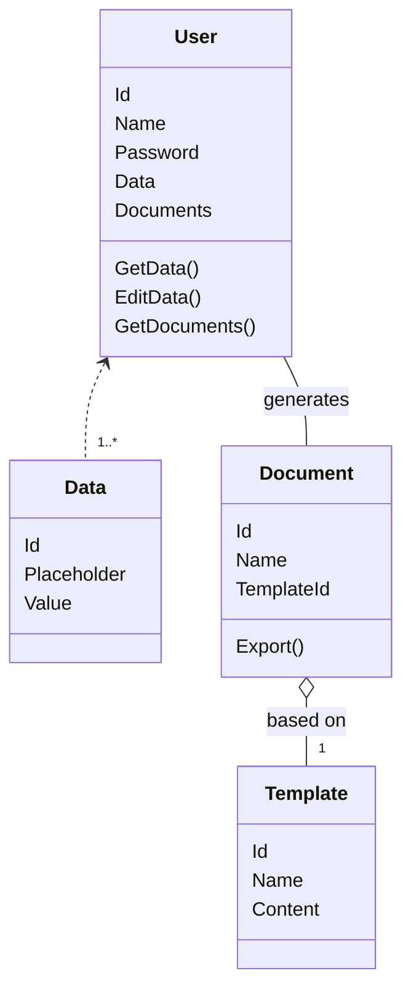

# Electroform Lite

```mermaid
classDiagram
class User{
  Id
  Name
  Password
  Data
  Documents

  GetData()
  EditData()
  GetDocuments()
}
class Data{
  Id
  Placeholder
  Value
}
class Document{
  Id
  Name
  TemplateId
  Export()
}
class Template{
  Id
  Name
  Content
}

User <.. "1..*" Data
User -- Document : generates
Document o-- "1" Template : based on
```
